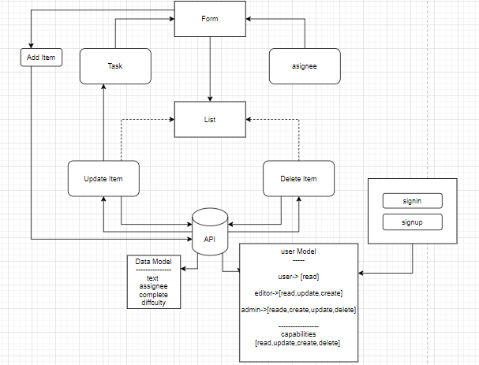

# todo
## Author: NeveenBeiram

### Run The App : 
`npm start` 

[deployment netlify](https://neveen-to-do.netlify.app/)

### Hooks/ Phase1 : 

### UML :

### Custom Hooks/ Phase2 :

### context/ phase3

### auth/phase 4:
